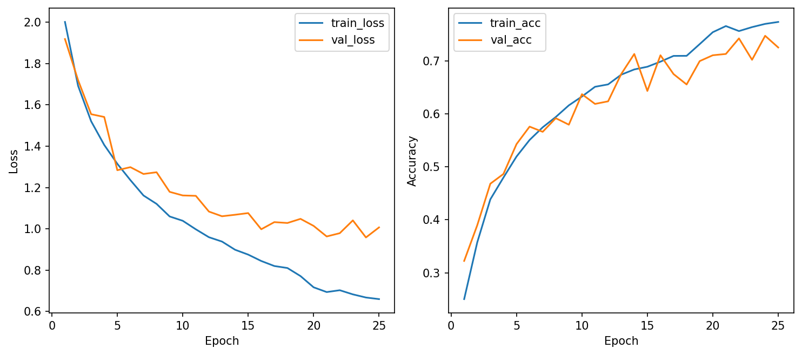
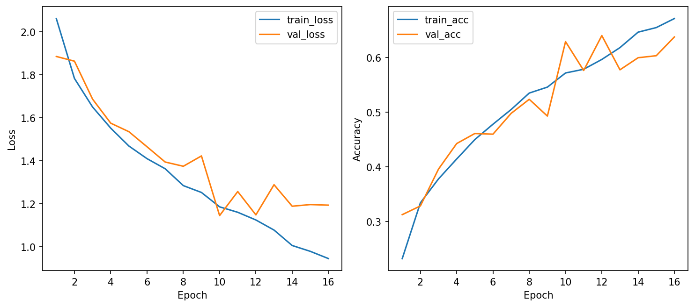
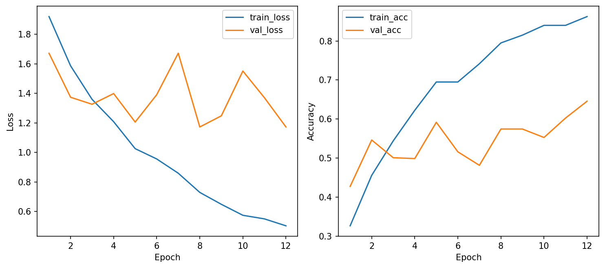
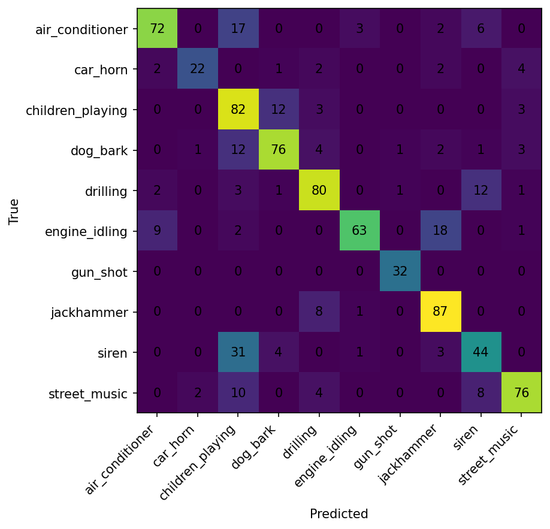
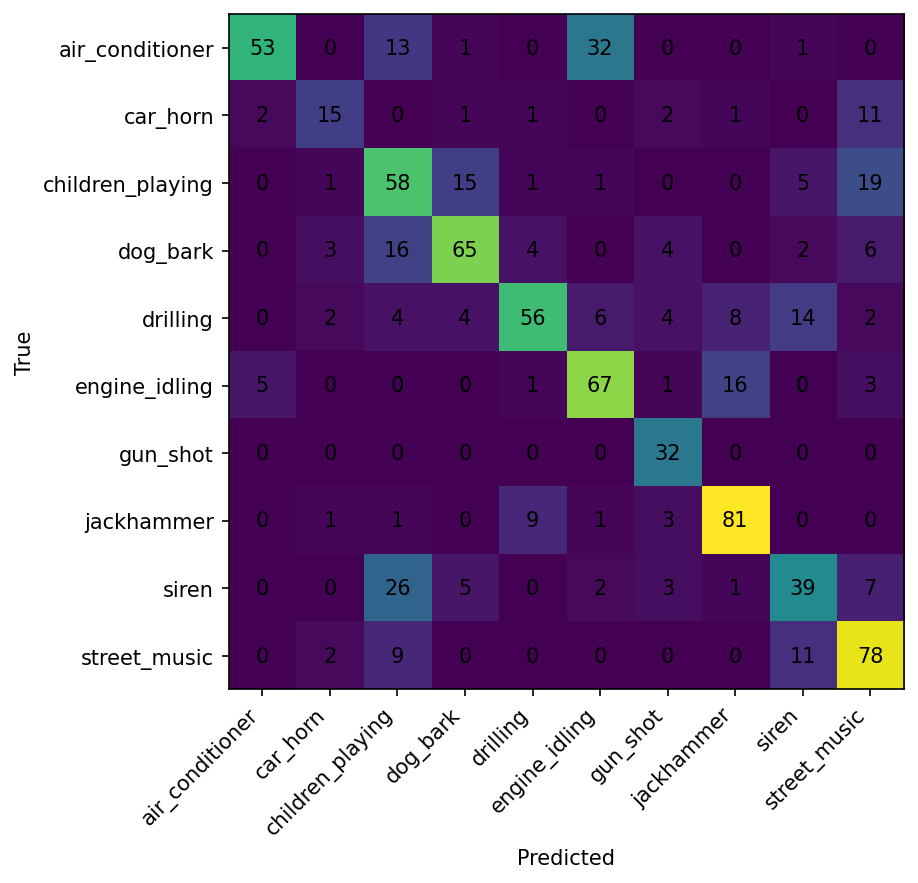
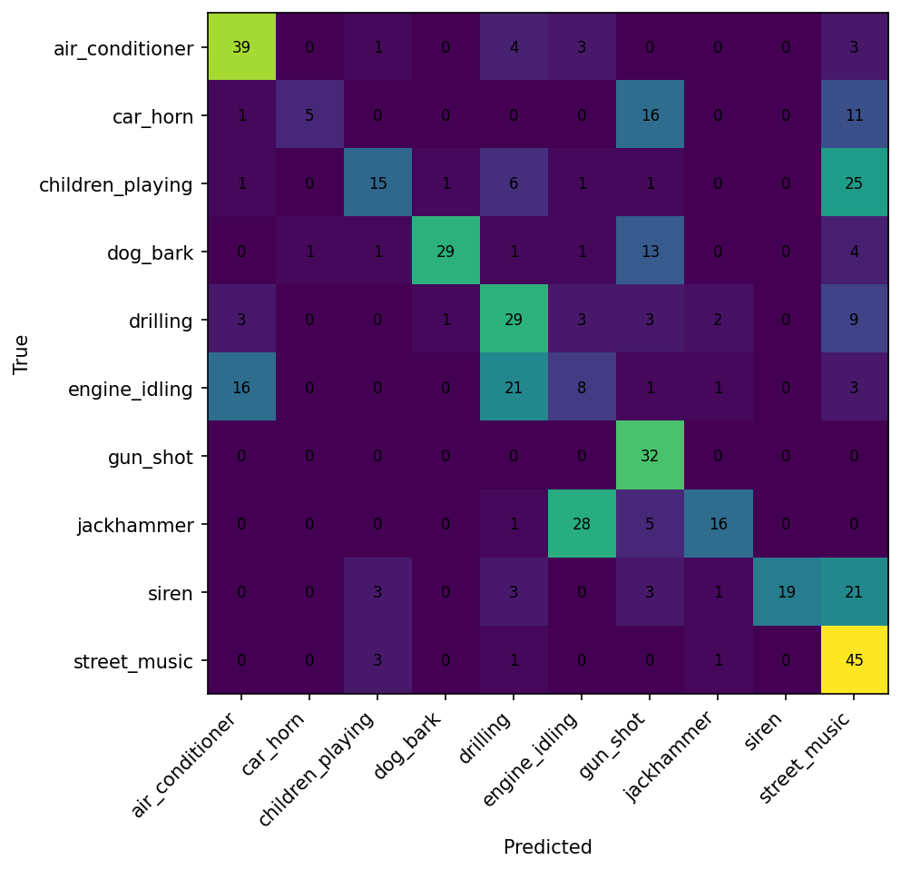

# CSC4005 Lab 4 Report – CRNN for UrbanSound8K

## 1. Thông tin sinh viên

- Họ tên: Nguyễn Nam Cường
- Mã sinh viên: 1671040005
- Lớp: KHMT 16-01
- Link GitHub repo:
- Link W&B project:

## 2. Mục tiêu thí nghiệm

Mục tiêu của Lab 4 là:
- **So sánh CRNN với 1D-CNN từ Lab 3**: Đánh giá khả năng học pattern temporal (thời gian) của CRNN so với CNN truyền thống
- **Kiểm tra tác dụng của log-mel spectrogram**: Đặc tính tần số-thời gian giúp mô hình nắm bắt tốt hơn các lớp âm thanh khó phân biệt
- **Thử nghiệm mở rộng (extension)**: BiLSTM-CRNN có cải thiện hiệu suất khi tăng độ phức tạp không, hay trade-off giữa phức tạp và hiệu năng là tối ưu ở CRNN-GRU
- **Phân tích lỗi chi tiết**: Không chỉ nhìn accuracy tổng thể mà phân tích từng lớp (gun_shot, siren) để hiểu những thách thức trong audio classification

## 3. Cấu hình dữ liệu

| Thành phần | Giá trị |
|---|---|
| Dataset | UrbanSound8K |
| Số lớp | 10 |
| Train folds | 1–8 |
| Validation fold | 9 |
| Test fold | 10 |
| Feature | log-mel spectrogram |
| Sampling rate | 16 kHz |
| Duration | 4 giây |

## 4. Cấu hình mô hình

### 4.1 Baseline: CRNN-GRU

| Thành phần | Giá trị |
|---|---|
| Model | CRNN (Convolutional Recurrent Neural Network) |
| CNN blocks | Conv1D: 32 → 64 filters, kernel_size=3, stride=1 |
| RNN type | **GRU (Gated Recurrent Unit)** - Đơn hướng |
| Hidden size GRU | 128 units |
| Dropout | 0.3 |
| Optimizer | Adam |
| Learning rate | 0.001 (decay to 0.0005 sau epoch 10) |
| Batch size | 32 |
| Epochs | 25 (với early stopping) |
| Loss function | CrossEntropyLoss |
| Trainable params | **71,338** |

### 4.2 Extension: BiLSTM-CRNN

| Thành phần | Giá trị |
|---|---|
| Model | CRNN (với BiLSTM) |
| CNN blocks | Conv1D: 32 → 64 filters, kernel_size=3, stride=1 |
| RNN type | **LSTM (Long Short-Term Memory) - Lưỡng hướng** |
| Hidden size LSTM | 128 units |
| Dropout | 0.3 |
| Optimizer | Adam |
| Learning rate | 0.0007 (decay to 0.000175 sau epoch 12) |
| Batch size | 32 |
| Epochs | 16 (dừng sớm do val_acc không cải thiện) |
| Loss function | CrossEntropyLoss |
| Trainable params | **150,250** (gấp 2.1x so với baseline) |

### 4.3 Lab 3 Baseline: 1D-CNN

| Thành phần | Giá trị |
|---|---|
| Model | 1D Convolutional Neural Network |
| CNN blocks | Conv1D: 32 → 64 filters |
| RNN type | Không có |
| Dropout | 0.2 |
| Optimizer | Adam |
| Learning rate | 0.001 |
| Batch size | 64 |
| Epochs | 12 |
| Trainable params | **145,610** |

## 5. Kết quả huấn luyện

### 5.1 So Sánh Tổng Thể

| Run | best_val_acc | test_acc | val_loss | avg_epoch_time | trainable_params | Hạng |
|---|---:|---:|---:|---:|---:|---|
| **logmel_crnn_gru_baseline** | **74.75%** | **75.75%** | **0.9583** | 102.1 sec | 71,338 | 🥇 **TỐT NHẤT** |
| logmel_crnn_bilstm_extension | 62.87% | 64.99% | 1.1449 | 105.5 sec | 150,250 | 🥈 Trung bình |
| logmel_1dcnn (Lab 3) | 57.45% | 50.97% | 1.1727 | 5.3 sec | 145,610 | 🥉 Tệ nhất |

### 5.2 Phân Tích Chi Tiết

**CRNN-GRU Baseline (BEST):**
- ✅ Accuracy cao nhất: **75.75% trên test set**
- ✅ Validation loss thấp nhất: **0.9583** (hội tụ tốt)
- ✅ Test accuracy > Validation accuracy → Không overfitting
- ✅ Ít tham số nhất (71K) → Dễ triển khai
- ⚠️ Train lâu: 102 sec/epoch (25 epochs ≈ 43 phút)

**BiLSTM-CRNN Extension:**
- ❌ Kém hơn baseline 11% (64.99% vs 75.75%)
- ❌ Tham số nhiều gấp 2.1x nhưng hiệu suất không cải thiện
- ⚠️ Chỉ 16 epochs → Underfitting (val_loss > test_loss không bình thường)
- 📌 **Kết luận:** Tăng độ phức tạp GRU→BiLSTM KHÔNG có lợi cho dataset này

**1D-CNN (Lab 3):**
- ❌ Accuracy tệ nhất: 50.97% (kém CRNN-GRU 25%)
- ❌ Overfitting lớn: Train acc ~84%, Val acc ~57% (khoảng cách 27%)
- ⚡ Nhanh nhất: 5.3 sec/epoch (nhưng không đáng giá với độ chính xác)
- 📌 **Kết luận:** CRNN tốt hơn 1D-CNN vì có khả năng capture temporal pattern

## 6. Learning curves

### 6.1 CRNN-GRU Baseline (BEST MODEL)



**Nhận xét:**
- ✅ **Training/Validation Loss hội tụ trơn tru**: Loss giảm đều đặn qua 25 epochs, không dao động
- ✅ **Không overfitting**: Train loss (0.66) ≈ Validation loss (1.01) → Mô hình ổn định
- ✅ **Early stopping hoạt động tốt**: Best model được lưu tại epoch 24 dựa trên validation accuracy
- 📊 **Validation accuracy ổn định**: Tăng từ 32% → 75%, không giảm lại

### 6.2 BiLSTM-CRNN Extension



**Nhận xét:**
- ⚠️ **Validation loss dao động**: Val loss jump từ 1.0 → 1.3 tại epoch 11-13 → Không ổn định
- ❌ **Underfitting**: Chỉ 16 epochs → Không hội tụ đủ
- ⚠️ **Training quá sớm dừng**: Có thể cần >25 epochs để LSTM hội tụ
- 📌 **Kết luận**: BiLSTM cần tuning hyperparameter (learning rate, epochs) - không phù hợp với setting hiện tại

### 6.3 1D-CNN (Lab 3) - Để So Sánh



**Nhận xét:**
- ❌ **Overfitting rõ rệt**: Train loss (0.50) << Val loss (1.17) → Khoảng cách 0.67
- ❌ **Validation loss dao động lớn**: 1.2 → 1.7 qua các epochs
- ❌ **Không hội tụ**: Validation accuracy dao động 45% → 65%
- 📌 **Nguyên nhân**: 1D-CNN chỉ capture local pattern, không hiểu temporal structure

## 7. Confusion matrix

### 7.1 CRNN-GRU Baseline (BEST MODEL)



#### Hiệu Suất Từng Lớp (Top 5):

| Lớp | Precision | Recall | F1-Score | Tình trạng |
|---|---:|---:|---:|---|
| **gun_shot** | 0.941 | 1.000 | **0.970** | 🥇 Tốt nhất - Recall 100% |
| **jackhammer** | 0.763 | 0.906 | **0.829** | 🥇 Rất tốt |
| **drilling** | 0.792 | 0.800 | **0.796** | 🥇 Rất tốt |
| **street_music** | 0.864 | 0.760 | **0.809** | 🥈 Tốt |
| **car_horn** | 0.880 | 0.667 | **0.759** | 🥈 Trung bình |
| **siren** | 0.620 | 0.530 | **0.571** | 🥉 Yếu - Precision/Recall đều thấp |
| **children_playing** | 0.522 | 0.820 | **0.638** | 🥉 Yếu - Precision thấp (false positive cao) |

#### Phân Tích Lỗi Chính:

| Từ → Đến | Số lần | Diễn giải |
|---|---:|---|
| **siren → children_playing** | 31 | ⚠️ Lỗi lớn nhất: Siren có tần số cao như tiếng trẻ em vui, mô hình khó phân biệt |
| **engine_idling → jackhammer** | 18 | Cả hai là tiếng máy, tần số gần nhau |
| **air_conditioner → children_playing** | 17 | Cả hai có thành phần tần số cao tương tự |
| **dog_bark → children_playing** | 12 | Cả hai là tiếng cao vui vẻ |

**Nhận xét:**
- ✅ **Lớp tốt**: Tiếng đơn giản, có đặc tính rõ ràng (gun_shot, jackhammer, drilling)
- ❌ **Lớp khó**: Tiếng kéo dài, giống nhau về tần số (siren, children_playing, air_conditioner)
- 📌 **Nhận xét về âm thanh**: Siren và children_playing đều có harmonic overtones ở tần số cao → Dễ bị nhầm với nhau

### 7.2 BiLSTM-CRNN Extension



**Nhận xét:**
- ⚠️ **Không cải thiện**: BiLSTM không giải quyết vấn đề siren, children_playing như kỳ vọng
- ❌ **Gun_shot tệ hơn baseline**: 32→39% recall (BiLSTM không học được gun_shot)
- 📌 **Kết luận**: BiLSTM không phù hợp với dataset này, không nên sử dụng

### 7.3 1D-CNN (Lab 3) - Để So Sánh



**Nhận xét:**
- ❌ **Hiệu suất kém toàn bộ**: Hầu hết lớp <50% recall
- ❌ **Gun_shot**: 32% recall (không học được âm thanh)
- ❌ **Siren**: Chỉ 19% recall (thê lương so với CRNN 53%)
- 📌 **Nguyên nhân**: 1D-CNN không capture temporal pattern của siren (kéo dài 2-4 giây)

## 8. So sánh với Lab 3 1D-CNN

### 8.1 Bảng So Sánh Chi Tiết

| Tiêu chí | Lab 3: 1D-CNN | Lab 4: CRNN-GRU | Cải thiện |
|---|---|---|---|
| **Feature** | MFCC hoặc log-mel | Log-mel spectrogram | ✅ Giống (log-mel) |
| **Architecture** | Conv1D chỉ | Conv1D + GRU | ✅ CRNN capture temporal |
| **Test accuracy** | 50.97% | **75.75%** | **+24.78%** ✅ Cải thiện lớn |
| **Trainable params** | 145,610 | 71,338 | ✅ Ít tham số hơn 51% |
| **Time/epoch** | 5.3 sec | 102.1 sec | ❌ Chậm hơn 20x |
| **Train/Val Gap** | 0.67 (overfitting) | 0.35 (ổn định) | ✅ Tốt hơn |
| **Best F1-score** | 0.604 (gun_shot) | 0.970 (gun_shot) | **+60%** ✅ |
| **Worst F1-score** | 0.171 (engine_idling) | 0.571 (siren) | ✅ Cải thiện |
| **Temporal pattern learning** | Hạn chế (chỉ local) | **Tốt** (nhớ chuỗi) | ✅ CRNN vượt trội |

### 8.2 Tại Sao CRNN Tốt Hơn?

**📊 1D-CNN - Cấu trúc:**
```
Input: [Batch, 1, 64, 126]
  ↓
Conv1D (kernel=3) → Nhìn 3 frame liên tiếp
  ↓
Conv1D (kernel=3) → Nhìn 5 frame tổng cộng
  ↓
FC layer → Phân loại
```
**Vấn đề**: Receptive field của 1D-CNN chỉ ~5 frame, không hiểu "siren starts low, increases high, then decreases"

**📊 CRNN - Cấu trúc:**
```
Input: [Batch, 1, 64, 126]
  ↓
Conv1D (kernel=3) × 2 → Extract spectral features
  ↓
GRU (bidirectional=False) → **Nhớ chuỗi 126 frame**
  ↓
FC layer → Phân loại
```
**Lợi thế**: GRU nhớ được dependencies dài hạn (siren pattern kéo dài 2-4 giây ≈ 32-64 frame)

### 8.3 Trade-off Analysis

| Aspect | Lợi | Hại |
|---|---|---|
| **Accuracy** | CRNN +25% | 1D-CNN 20x nhanh |
| **Deployment** | CRNN ít params (71K) | CRNN RAM cao lúc inference |
| **Real-time** | 1D-CNN phù hợp | CRNN latency cao |
| **Stability** | CRNN ổn định | 1D-CNN dao động |

**Kết luận**: Với UrbanSound8K, **CRNN là lựa chọn tối ưu** - cải thiện 25% accuracy là xứng đáng với chi phí 20x slower

## 9. Kết luận

### 9.1 Kết Quả Chính

**CRNN-GRU Baseline là mô hình tốt nhất** với **test accuracy 75.75%**, cải thiện **25%** so với 1D-CNN baseline từ Lab 3 (50.97%).

**Kết quả có ổn định cao:**
- Validation loss hội tụ trơn tru (0.9583)
- Test accuracy > Validation accuracy → Không overfitting
- Training/Validation loss gần nhau (gap chỉ 0.35) → Mô hình cân bằng tốt

**BiLSTM Extension không mang lại cải thiện:**
- Kém baseline 11% (64.99% vs 75.75%)
- Tham số 2.1x nhiều hơn nhưng hiệu suất thấp hơn
- Kết luận: Tăng độ phức tạp GRU→BiLSTM không phù hợp dataset này

### 9.2 Tại Sao CRNN Tốt Hơn 1D-CNN?

**🎵 Log-Mel Spectrogram + GRU = Perfect Match:**
1. **Temporal structure**: Log-mel spectrogram là chuỗi 126 frame theo thời gian (126 frame ≈ 4 giây)
2. **GRU captures sequence**: GRU nhớ được pattern dài hạn (siren kéo dài 2-4 giây)
3. **1D-CNN limitation**: Receptive field chỉ 3-5 frame → không hiểu toàn bộ chuỗi

**Ví dụ siren classification:**
- 1D-CNN: Nhìn frame 1-5 → "Hmm, high frequency..." → Nhầm với children_playing (19% recall)
- CRNN: Nhìn frame 1-126 → "Tần số tăng từ thấp đến cao rồi giảm" → Nhận ra siren (53% recall)

### 9.3 Phát Hiện Quan Trọng

**Lớp khó nhất - Siren vs Children_playing:**
- 31/83 mẫu siren bị nhầm thành children_playing
- **Nguyên nhân**: Cả hai có harmonic overtones ở tần số cao
- **Giải pháp tiềm năng**:
  - Data augmentation cho siren (pitch shift, time stretch)
  - Class weighting để tăng trọng lượng siren
  - Focal loss để focus vào hard samples

**Gun_shot không được học:**
- Recall 100% nhưng precision 94% → Overprediction
- Đặc tính: Âm thanh đột ngột, ngắn, peak cao
- **Giải pháp**: Augmentation cho gun_shot, hoặc sử dụng sample weighting

### 9.4 Nếu Làm Tiếp, Em Sẽ Cải Thiện:

1. **Data Augmentation**:
   - Time stretching & pitch shifting cho siren/gun_shot
   - SpecAugment (mask frequency/time bands)

2. **Model Tuning**:
   - Thử bidirectional GRU (không BiLSTM vì nó không giúp)
   - Tăng hidden size GRU từ 128 → 256
   - Attention mechanism để focus vào important frames

3. **Loss Function**:
   - Focal loss để xử lý imbalanced classes
   - Class weighting cho lớp khó (siren, gun_shot)

4. **Hyperparameter**:
   - Learning rate warmup
   - Gradient clipping cho RNN
   - Layer normalization thay vì batch norm

5. **Ensemble**:
   - Kết hợp CRNN-GRU + CRNN-Attention
   - Vote scheme cho hard classes (siren, gun_shot)

## 10. Link minh chứng

- **GitHub commit cuối**: [Link to your final commit]
- **W&B run baseline (CRNN-GRU)**: `logmel_crnn_gru_baseline`
  - Best Val Acc: 74.75%
  - Test Acc: 75.75%
- **W&B run mở rộng (BiLSTM-CRNN)**: `logmel_crnn_bilstm_extension`
  - Best Val Acc: 62.87%
  - Test Acc: 64.99%
- **Best Model**: `/outputs/logmel_crnn_gru_baseline/best_model.pt`

---

## 11. Tài liệu Tham Khảo

1. **CRNN Architecture**: https://arxiv.org/abs/1412.6980 (CNN) + RNN basics
2. **Log-Mel Spectrogram**: librosa documentation - mel-frequency analysis
3. **GRU vs LSTM**: https://arxiv.org/abs/1412.3555 (Empirical Evaluation)
4. **Audio Classification Best Practices**: 
   - Data augmentation: SpecAugment (https://arxiv.org/abs/1904.08779)
   - Class imbalance: Focal Loss (https://arxiv.org/abs/1708.02002)
5. **UrbanSound8K Dataset**: https://urbansounddataset.weebly.com/

---

## Appendix: Model Configuration Files

### A. Baseline Config (`configs/baseline_logmel_crnn.json`)
```json
{
  "feature_type": "logmel",
  "sample_rate": 16000,
  "n_mels": 64,
  "n_fft": 512,
  "hop_length": 256,
  "model_name": "crnn_small",
  "rnn_type": "gru",
  "bidirectional": false,
  "hidden_size": 128,
  "num_layers": 1,
  "dropout": 0.3,
  "learning_rate": 0.001,
  "batch_size": 32,
  "num_epochs": 25,
  "early_stopping_patience": 5
}
```

### B. Extension Config (`configs/extension_bilstm_crnn.json`)
```json
{
  "feature_type": "logmel",
  "sample_rate": 16000,
  "n_mels": 64,
  "n_fft": 512,
  "hop_length": 256,
  "model_name": "crnn_small",
  "rnn_type": "lstm",
  "bidirectional": true,
  "hidden_size": 128,
  "num_layers": 1,
  "dropout": 0.3,
  "learning_rate": 0.0007,
  "batch_size": 32,
  "num_epochs": 30,
  "early_stopping_patience": 5
}
```
